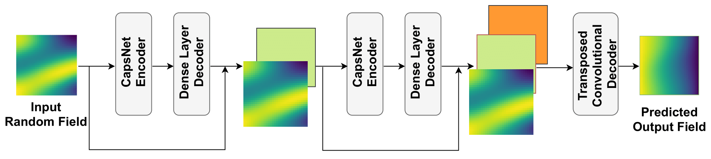

# Deep Capsule Encoder-Decoder Network for Surrogate Modeling and Uncertainty Quantification

This repository contains the code and data for the article "Deep Capsule Encoder-Decoder Network for Surrogate Modeling and Uncertainty Quantification" by Akshay Thakur and Souvik Chakraborty.

## Abstract

In this article, we propose a deep learning model for surrogate modeling and uncertainty quantification using capsule networks. 
The proposed model, called deep capsule encoder-decoder network (DCEDN), is a variant of the capsule network architecture that combines the benefits of both encoder-decoder networks and capsules. We evaluate the performance of the DCEDN on two different applications: a fluid dynamics problem and a stochastic partial differential equation (SPDE) based problem. 

    

## Contents

- `Model and Experiments`: The two jupyter notebooks contain the model and the scripts to run the experiments and reproduce the results reported in the article.

## Data
The data for SPDE was generated by modifying the code provided with the article [Deep-UQ](https://doi.org/10.1016/j.jcp.2018.08.036),
and the data for flow past cylinder was taken from article [Transformers for modeling physical systems](https://doi.org/10.1016/j.neunet.2021.11.022).

The data for SPDE can be accessed via the following link - [Dataset_SPDE](https://drive.google.com/drive/folders/12_rvdqJwO6wopP0LhyHqe0kjY8SN0fo6?usp=share_link)

## Requirements

The code is written in Python 3 and requires the following libraries:

- Tensorflow 2.9.2
- Pandas
- Numpy
- Matplotlib

